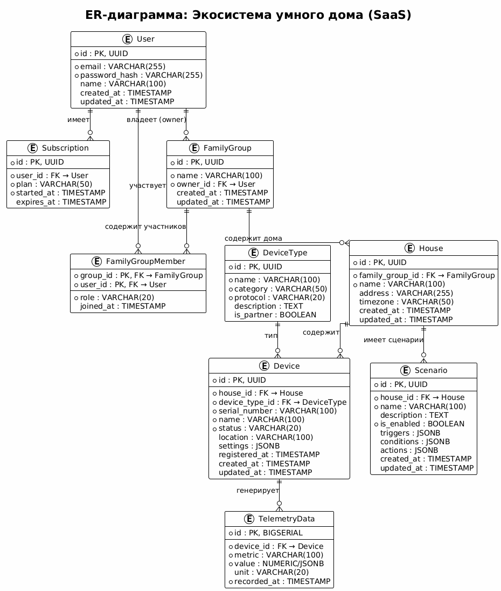

# Project_template

Это шаблон для решения проектной работы. Структура этого файла повторяет структуру заданий. Заполняйте его по мере работы над решением.

# Задание 1. Анализ и планирование

<aside>

Чтобы составить документ с описанием текущей архитектуры приложения, можно часть информации взять из описания компании и условия задания. Это нормально.

</aside

### 1. Описание функциональности монолитного приложения

**Управление отоплением:**

- Пользователи могут регулировать отоплениев в доме
- Система поддерживает возможность апдейтить статусы у датчиков (вкл/выкл)

**Мониторинг температуры:**

- Пользователи могут запросить температуру отдельных помещений в системе
- Система поддерживает передачу данных от датчиков, которые могут быть установлены в разных комнатах - запросить можно по айдишнику датчика или по локации его установки 
- Данные о температуре предоставляет внешний сервис, поэтому если он ляжет, то актуальных данных по температуре пользователь не получит

**Подключение новых пользователей:**

- Специалисты камнании могут подключать новых пользователей только самостоятельно, совершая выезд на адрес к клиенту
- Система поддерживает CRUD api для новых датчиков управления отоплением

**Health check:**

- Система поддерживает health check ручку для проверки собственной работоспособности

### 2. Анализ архитектуры монолитного приложения

Перечислите здесь основные особенности текущего приложения: какой язык программирования используется, какая база данных, как организовано взаимодействие между компонентами и так далее.

Технологический стек:
	Язык: Go 1.22
	БД: PostgreSQL
	HTTP: Gin

Система состоит из трех слоев:
	1. само приложение где сосредоточено все для работы (ручки, валидация, бизнес-логика)
	2. слой соединения с бд
	3. слой с точкой входа для внешнего сервиса определения температуры

В БД одна таблица с датчикамию

Для запроса температуры в рантайме используется внешний сервис TemperatureService. Он может передавать данные с конкретных датчиков - запрос или по айдишнику датчика или по месту его размещения. При этом обновление данных по температуре в базе не происходит

Точка старта приложения - apps/smart_home/main.go

### 3. Определение доменов и границы контекстов

Домен "Управление устройствами" 
	1. Поддомен "подключение устройств к системе"
		- контекст: регистрация устройства
			объект - новый датчик
			репозиторий - ручки для создания и удаления датчиков
	2. Поддомент "управление отоплением"
		- контекст: управление отоплением
			объект - датчик
			объект-значения - значение температуры сохраненное в базе, статус датчика
			агрегатор - таблица датчиков объекта
			репозиторий - ручки для управления датчиками
	3. Поддомен "мониторинг температуры"
		- контекст: получение актуальной температу
			объект - датчик
			объект-значения - температура в текущий момент времени
			репозиторий - ручки для запроса температуры у внешнего сервиса
			сервис - внешний сервис мониторинга температуры

### **4. Проблемы монолитного решения**

- Внесение изменений в единую систему чревато появлением непредсказуемых ошибок, из-за того что потенциально может сломаться все что угодно
- Что бы невелировать первый риск придется тестировать все приложение целиком при каждой выкладке релиза - что ведет к увеличению сроков разработки
- Система сама по себе очень не большая, поэтому в перриод бустрого развития возниккнет проблема толкучки для разработчиков - условно каждая задача может быть связана с зонами в системе которыми сейчас занимается другой разработчик в другой задаче, что непременно приведет к конфликтам при мерже

Что не станет проблемой на мой взгляд:
- Команда на проекте не большая, поэтому маловероятно что возникнут хоть какието сложности административного характера
- Пока что не просматривается необходимость маштабировать прямо какие-то одельные элементы системы, скорее наоборот - придется маштабировать всю систему, что не является проблемой для монолита

### 5. Визуализация контекста системы — диаграмма С4

Стартовая контекстная диаграмма монолита

# Задание 2. Проектирование микросервисной архитектуры

В этом задании вам нужно предоставить только диаграммы в модели C4. Мы не просим вас отдельно описывать получившиеся микросервисы и то, как вы определили взаимодействия между компонентами To-Be системы. Если вы правильно подготовите диаграммы C4, они и так это покажут.

**Диаграмма контейнеров (Containers)**

Контейнерная диаграмма будущей системы

**Диаграмма компонентов (Components)**

Диаграммы компонентов будущей системы

**Диаграмма кода (Code)**

Диаграммы компонентов будущей системы

# Задание 3. Разработка ER-диаграммы

ER-диаграмма: Экосистема умного дома (SaaS)

# Задание 4. Создание и документирование API

Я решил использовать REST потому что:
- сервис сам по себе не очень сложный и все взаимодействия между микросервисами не видятся сложными - поэтому не вижу смысла переусложнять? надо использовать самый простой и понятный тип
- большая асть сценариев и так идеально ложиться в парадигму 'запрос - моментальный ответ', оставшаяся небольшая часть? для которой возможно более предпочтителен отложенный ответ, тоже в нее ложиться без проблем

[REST API](api/openapi.yaml)

# Задание 5. Работа с docker и docker-compose

Готово

# **Задание 6. Разработка MVP**

Необходимо создать новые микросервисы и обеспечить их интеграции с существующим монолитом для плавного перехода к микросервисной архитектуре. 

### **Что нужно сделать**

1. Создайте новые микросервисы для управления телеметрией и устройствами (с простейшей логикой), которые будут интегрированы с существующим монолитным приложением. Каждый микросервис на своем ООП языке.
2. Обеспечьте взаимодействие между микросервисами и монолитом (при желании с помощью брокера сообщений), чтобы постепенно перенести функциональность из монолита в микросервисы. 

В результате у вас должны быть созданы Dockerfiles и docker-compose для запуска микросервисов. 